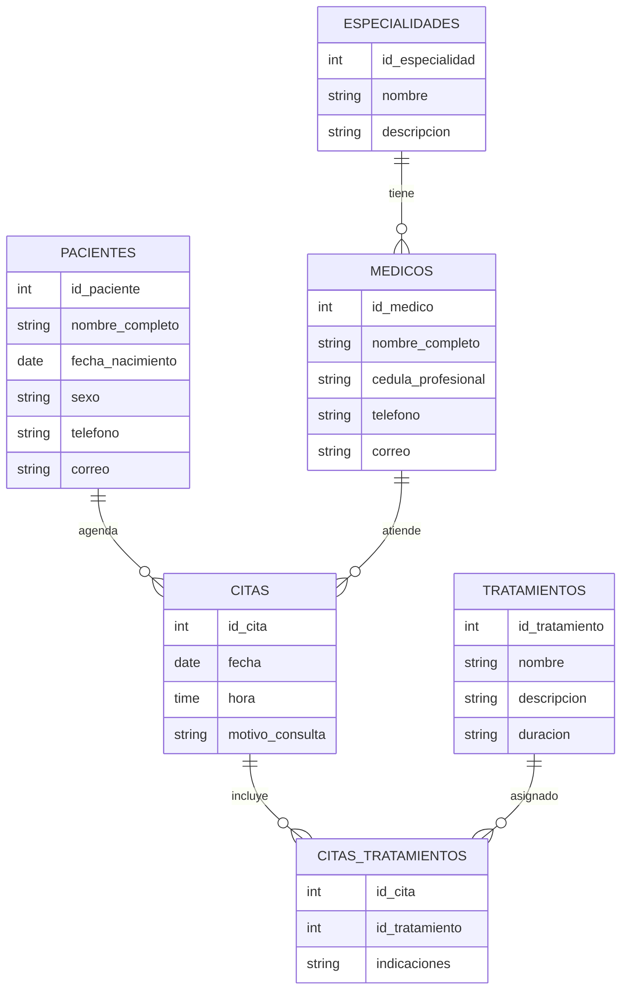

# Ejemplo de Modelado de Base de Datos: Consultorio Médico VitalCare

## 1. Lista de entidades con sus atributos (entre llaves)

- **Pacientes** `{id_paciente, nombre_completo, fecha_nacimiento, sexo, telefono, correo}`
- **Médicos** `{id_medico, nombre_completo, cedula_profesional, telefono, correo, id_especialidad}`
- **Especialidades** `{id_especialidad, nombre, descripcion}`
- **Citas** `{id_cita, fecha, hora, motivo_consulta, id_paciente, id_medico}`
- **Tratamientos** `{id_tratamiento, nombre, descripcion, duracion}`
- **Citas_Tratamientos** `{id_cita, id_tratamiento, indicaciones}`

## 2. Diagrama ER (texto)


Pacientes ---1------[agenda]---N------ Citas

Médicos ---1------[atiende]---N------ Citas

Médicos ---N------[pertenece]---1------ Especialidades

Citas ---N------[aplica]---M------ Tratamientos

Citas_Tratamientos: Relaciona Citas y Tratamientos con indicaciones específicas


## 3. Ejemplo de diagrama de entidad-relación


## 4. Códigos DDL

### 1. Pacientes

```sql
CREATE TABLE Pacientes (
  id_paciente INT PRIMARY KEY AUTO_INCREMENT,
  nombre_completo VARCHAR(100) NOT NULL,
  fecha_nacimiento DATE NOT NULL,
  sexo ENUM('M','F') NOT NULL,
  telefono VARCHAR(20),
  correo VARCHAR(100)
);
```

### 2. Especialidades

```sql
CREATE TABLE Especialidades (
  id_especialidad INT PRIMARY KEY AUTO_INCREMENT,
  nombre VARCHAR(50) NOT NULL,
  descripcion VARCHAR(200)
);
```

### 3. Médicos

```sql
CREATE TABLE Medicos (
  id_medico INT PRIMARY KEY AUTO_INCREMENT,
  nombre_completo VARCHAR(100) NOT NULL,
  cedula_profesional VARCHAR(20) NOT NULL,
  telefono VARCHAR(20),
  correo VARCHAR(100),
  id_especialidad INT,
  FOREIGN KEY (id_especialidad) REFERENCES Especialidades(id_especialidad)
);
```

### 4. Citas

```sql
CREATE TABLE Citas (
  id_cita INT PRIMARY KEY AUTO_INCREMENT,
  fecha DATE NOT NULL,
  hora TIME NOT NULL,
  motivo_consulta VARCHAR(200),
  id_paciente INT,
  id_medico INT,
  FOREIGN KEY (id_paciente) REFERENCES Pacientes(id_paciente),
  FOREIGN KEY (id_medico) REFERENCES Medicos(id_medico)
);
```

### 5. Tratamientos

```sql
CREATE TABLE Tratamientos (
  id_tratamiento INT PRIMARY KEY AUTO_INCREMENT,
  nombre VARCHAR(100) NOT NULL,
  descripcion VARCHAR(200),
  duracion VARCHAR(50)
);
```

### 6. Citas_Tratamientos

```sql
CREATE TABLE Citas_Tratamientos (
  id_cita INT,
  id_tratamiento INT,
  indicaciones VARCHAR(200),
  PRIMARY KEY (id_cita, id_tratamiento),
  FOREIGN KEY (id_cita) REFERENCES Citas(id_cita),
  FOREIGN KEY (id_tratamiento) REFERENCES Tratamientos(id_tratamiento)
);
```
