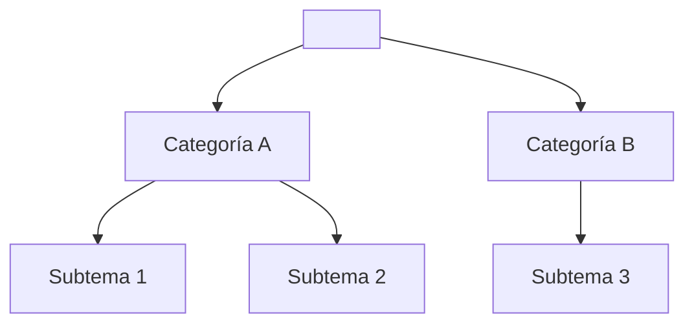

<!--
Archivo: <TEMA>.md
Guía completa para desarrollar cualquier tema a profundidad. Contiene estructura jerárquica detallada, para usar con Copilot en VSC o como plantilla de estudio.
-->

# Desarrollo Profundo del Tema: **<TEMA>**

---

## 1. Introducción General
- **Definición completa:** ¿Qué es <TEMA> y por qué es importante?
- **Objetivo del tema:** ¿Qué busca resolver o aportar?
- **Aplicaciones generales:** Campos, industrias, o áreas donde se usa.

---

## 2. Estructura Jerárquica del Tema
Lista organizada de subtemas, clasificados y con espacio para explicación detallada.

### 2.1 Categorías Principales
| Categoría | Descripción breve |
|-----------|-------------------|
| Categoría A |                   |
| Categoría B |                   |
| Categoría C |                   |

---

## 3. Desarrollo Detallado por Categoría
Para cada categoría/subtema importante, incluye:

### 3.x. <Nombre del Subtema>
- **Definición:** Precisa y técnica.
- **Elementos o Componentes:**
  - Elemento 1
  - Elemento 2
- **Clasificación o Tipos:**
  - Tipo A: Definición, características, ejemplo.
  - Tipo B: Definición, características, ejemplo.
- **Características principales:**
  - Lista con 3–5 características clave.
- **Ventajas y Desventajas:**
  - Pros:  
  - Contras:
- **Ejemplo detallado o caso práctico:**
  - Situación:
  - Solución:

> Repetir este bloque para cada subtema relevante.

---

## 4. Diagrama de Relación (Opcional - Mermaid)

---

## 5. Interconexiones y Comparaciones
- **¿Cómo se relacionan los subtemas entre sí?**
- **Comparaciones clave entre tipos o enfoques:**
  - ¿Cuándo usar A vs. B?
  - ¿Cuál es más eficiente bajo ciertas condiciones?

---

## 6. Casos de Uso Avanzados
- **Caso 1:**
  - Contexto real
  - Aplicación del concepto
  - Resultados y aprendizaje

- **Caso 2:**
  - Contexto diferente
  - Variación o adaptación del uso

---

## 7. Problemas comunes y errores típicos
- **Errores de comprensión:**
  - Malinterpretación 1 y su corrección
- **Errores de implementación:**
  - Fallo común en código/procedimiento

---

## 8. Buenas prácticas y recomendaciones
- **Para estudiar el tema:**
  - Técnica o método sugerido.
- **Para aplicar el tema:**
  - Consideraciones y cuidados.

---

## 9. Recursos de Estudio
- **Documentación oficial:**
  - [Nombre del recurso](URL)
- **Videos o cursos:**
  - [Título / Canal](URL)
- **Libros recomendados:**
  - Título - Autor
- **Blogs o artículos de referencia:**
  - [Artículo útil](URL)

---

> Guarda este archivo como `<TEMA>.md`. Sustituye todos los marcadores y completa con ayuda de Copilot o como guía de estudio personal. Esta plantilla está pensada para cubrir un tema de forma profunda, técnica y estructurada.
