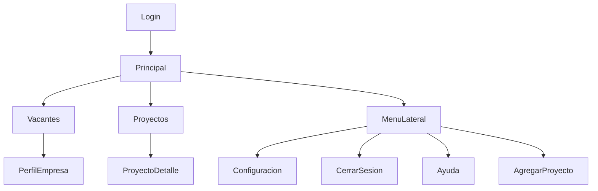

# Actividad: Diseño y Prototipado EP

## 1. Guía de Estilo

- **Tipografía:** Se utiliza una fuente sans-serif moderna y legible para todos los textos.
- **Paleta de colores:**
  - Morado principal: #6C3483
  - Amarillo acento: #FFC107
  - Rojo acento: #B22222
  - Blanco y gris claro para fondos y tarjetas
  - Verde para estados de éxito
- **Iconografía:** Uso de íconos simples y representativos para usuario, menú, y acciones principales.
- **Botones:**
  - Botón principal: fondo amarillo, texto morado/negrita
  - Botón secundario: fondo morado, texto blanco
  - Botón de acción: fondo rojo para eliminar/cerrar sesión
- **Menús:**
  - Menú lateral y menú desplegable con fondo morado y opciones claras
- **Espaciado:** Márgenes y paddings consistentes para separar secciones y elementos
- **Estilo visual general:** Minimalista, institucional, con predominancia del morado y el logo de Upemor en todas las pantallas

## 2. Wireframe o Mockup

> El prototipo visual se desarrolla en el archivo HTML (EP_MOCKUP.html) y será configurado en conjunto. Incluye al menos 5 pantallas/secciones: Login, Principal, Perfil de Empresa, Proyectos del Alumno, Menú Lateral.

## 3. Modelo de Navegación

El tipo de navegación se representa mediante un **diagrama de flujo tipo Mermaid**, que ilustra la estructura jerárquica con hubs y las conexiones entre las principales pantallas y secciones del sistema:

- **Tipo de navegación:** Jerárquico con hubs (la pantalla principal es el hub central)
- **Explicación:**
  - El usuario inicia sesión y accede a la pantalla principal (hub).
  - Desde ahí puede navegar a vacantes, proyectos o abrir el menú lateral para otras acciones.
  - El menú lateral está disponible en todas las pantallas para acceso rápido a funciones globales.

## 4. Método de Diseño Aplicado y Justificado

- **Método elegido:** Design Thinking
- **Por qué:** Permite centrar el diseño en las necesidades reales de los usuarios (alumnos y empresas), asegurando una interfaz intuitiva y funcional.
- **Cómo se aplicó:**
  1. Empatizar: Se analizaron las necesidades de los usuarios (acceso rápido, claridad visual, identidad institucional).
  2. Definir: Se identificaron los problemas clave (interfaces confusas, falta de identidad, dificultad de gestión).
  3. Idear: Se propusieron soluciones visuales y de flujo, priorizando la simplicidad y accesibilidad.
  4. Prototipar: Se crearon wireframes y mockups de las pantallas principales.
  5. Testear: Se ajustó el diseño con base en retroalimentación y pruebas de usabilidad.
- **Ejemplos concretos:**
  - El uso del color morado y el logo en todas las pantallas refuerza la identidad institucional.
  - La organización en tarjetas y menús laterales responde a la necesidad de claridad y acceso rápido.
  - Los botones y retroalimentación visual en la gestión de proyectos mejoran la experiencia del usuario.

## 5. Documento de Presentación del Proyecto

- **Nombre del equipo:** [Nombre del equipo]
- **Nombre de la app:** Directorio de Talento Upemor
- **Descripción general:** Plataforma web para que alumnos y empresas gestionen vacantes, proyectos y perfiles de manera centralizada y visualmente organizada.
- **Público objetivo:** Estudiantes de Upemor y empresas interesadas en talento universitario.
- **Resumen de decisiones de diseño:**
  - Se eligió Design Thinking para asegurar un enfoque centrado en el usuario.
  - El modelo de navegación jerárquico con hub facilita el acceso a todas las secciones.
  - La guía de estilo institucional refuerza la identidad y profesionalismo de la plataforma.
  - El prototipo visual y la estructura de la app priorizan la claridad, accesibilidad y facilidad de uso.

---

> Checklist final: Revisa que cada punto esté cubierto y justificado según la rúbrica. Si tienes dudas, pide retroalimentación antes de entregar.
