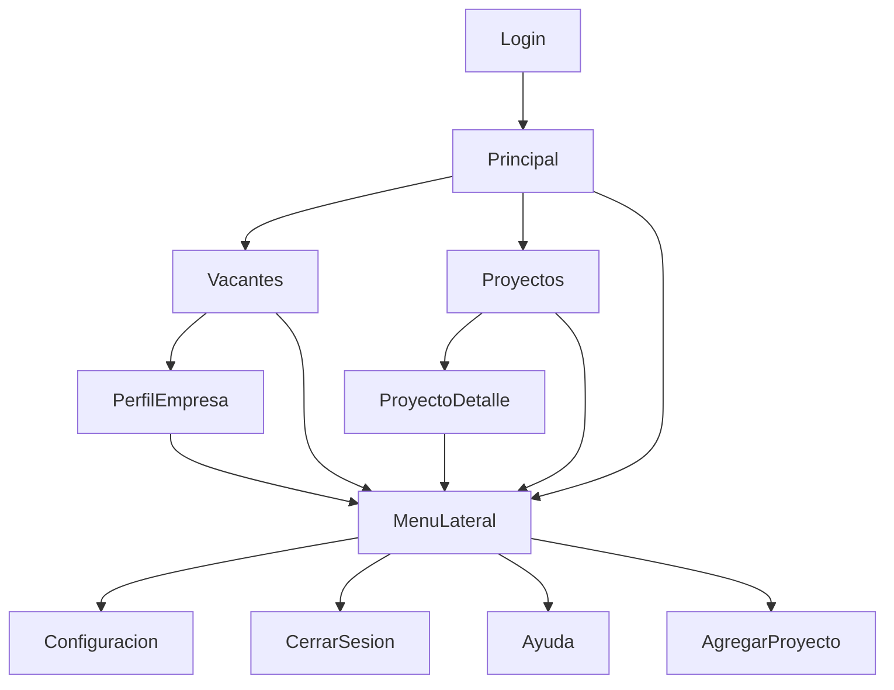

# Modelo de Navegación

## Tipo de navegación elegido: Jerárquico con hubs

### ¿Por qué este modelo?
Se eligió un modelo de navegación jerárquico con hubs porque permite organizar la información de manera clara y estructurada, facilitando el acceso a las diferentes secciones principales (vacantes, proyectos, perfil de empresa, configuración) desde una pantalla central o "hub" (pantalla principal). Esto mejora la experiencia del usuario, ya que puede regresar fácilmente al inicio y navegar entre secciones sin perderse.

### Diagrama de flujo entre pantallas (Mermaid)

### Explicación del modelo
- El usuario inicia sesión y accede a la pantalla principal, que funciona como hub.
- Desde el hub puede navegar a las vacantes, proyectos o abrir el menú lateral para otras acciones.
- Cada sección es accesible desde el hub, y siempre se puede regresar a la pantalla principal.
- El menú lateral está disponible en todas las pantallas para acceso rápido a funciones globales.

Este modelo asegura claridad, facilidad de uso y coherencia con la estructura visual y funcional desarrollada en el proyecto.
